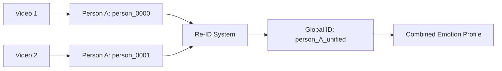

# Next Steps & Implementations - VideoEmotion Project

Your project has a complete emotion analysis pipeline but needs orchestration and improved configurability. Here's what to implement next.

## Current Pipeline State


**Existing Components:**
1. ✅ `extract_frames.py` - Extracts frames from videos at configurable FPS
2. ✅ `detect_faces.py` - MediaPipe face detection with tracking
3. ✅ `analyze_emotion.py` - Dual-model emotion analysis (HSEmotion + DeepFace)
4. ✅ `emotion_summary_report.py` - Generates comprehensive emotion summaries

**Issues:**
- ❌ All scripts have **hardcoded paths**
- ❌ No unified entry point
- ❌ Empty `requirements.txt`
- ❌ No documentation

---

## Proposed Changes

### Phase 1: Unified Pipeline Orchestration

#### [NEW] [pipeline.py](file:///c:/Users/ruben/Desktop/VideoEmotion/src/pipeline.py)

**Purpose:** Single entry point to run the complete analysis workflow

**Features:**
- Accept video path via CLI
- Automatically create organized output structure
- Run all steps sequentially: extract → detect → analyze → report
- Progress tracking and error handling
- Skip already-processed steps (incremental)

**Usage:**
```bash
python src/pipeline.py --video data/videos/my_video.mp4 --fps 5
```

---

### Phase 2: Remove Hardcoded Paths

#### [MODIFY] [extract_frames.py](file:///c:/Users/ruben/Desktop/VideoEmotion/src/extract_frames.py)
- Add `argparse` for `--video`, `--output`, `--fps`
- Keep skip logic (lines 98-102)

#### [MODIFY] [detect_faces.py](file:///c:/Users/ruben/Desktop/VideoEmotion/src/detect_faces.py)
- Add `argparse` for `--input-frames`, `--output-faces`
- Keep skip logic (lines 523-575)

#### [MODIFY] [analyze_emotion.py](file:///c:/Users/ruben/Desktop/VideoEmotion/src/analyze_emotion.py)
- Add `argparse` for `--faces-root`, `--output-root`
- Already has good skip logic (lines 476-486)

#### [MODIFY] [emotion_summary_report.py](file:///c:/Users/ruben/Desktop/VideoEmotion/src/emotion_summary_report.py)
- Add `argparse` for `--input-dir`, `--output-dir`
- Keep auto-detection logic (lines 465-496)

---

### Phase 3: Configuration & Dependencies

#### [NEW] [requirements.txt](file:///c:/Users/ruben/Desktop/VideoEmotion/requirements.txt)
Generate with all dependencies:
```txt
opencv-python
mediapipe
numpy
torch
hsemotion
deepface
tensorflow
```

#### [NEW] [config.yaml](file:///c:/Users/ruben/Desktop/VideoEmotion/config.yaml)
Centralize settings:
- Frame extraction FPS
- Face detection thresholds
- Emotion analysis confidence levels
- Smoothing windows

---

### Phase 4: Visualization (Optional Enhancement)

#### [NEW] [visualize_results.py](file:///c:/Users/ruben/Desktop/VideoEmotion/src/visualize_results.py)

**Purpose:** Create annotated video with emotion overlays

**Features:**
- Read emotion analysis results
- Overlay bounding boxes + emotion labels
- Color-coded by emotion type
- Export as new video with annotations

---

### Phase 5: Documentation

#### [NEW] [README.md](file:///c:/Users/ruben/Desktop/VideoEmotion/README.md)

**Sections:**
- Project overview
- Installation instructions
- Quick start guide
- Detailed usage examples
- Output structure explanation
- Configuration options

---

## New Features to Consider

### Phase 6: Real-Time Video Analysis

#### [NEW] [realtime_analysis.py](file:///c:/Users/ruben/Desktop/VideoEmotion/src/realtime_analysis.py)

**Purpose:** Analyze emotions from webcam/live video feed in real-time

**Features:**
- Live webcam emotion detection
- Real-time face tracking with emotion overlays
- Export recorded sessions with metadata
- Configurable FPS and display options

**Use Cases:**
- Interview analysis
- User testing sessions
- Live presentations
- Virtual meetings

---

### Phase 7: Cross-Video Person Re-identification

#### [NEW] [person_reid.py](file:///c:/Users/ruben/Desktop/VideoEmotion/src/person_reid.py)

**Purpose:** Track the same person across multiple videos

**Features:**
- Face embedding extraction (FaceNet/ArcFace)
- Cross-video matching with similarity scores
- Merge emotion profiles for the same person
- Generate unified reports per individual

**Enhanced Workflow:**


---

### Phase 8: Advanced Analytics Dashboard

#### [NEW] [dashboard.py](file:///c:/Users/ruben/Desktop/VideoEmotion/src/dashboard.py)

**Purpose:** Interactive web dashboard for exploring results

**Technology:** Streamlit or Flask + Plotly

**Features:**
- **Timeline View:** Emotion progression over video duration
- **Person Comparison:** Side-by-side emotion profiles
- **Heatmaps:** Emotional intensity across video segments
- **Export:** PDF reports with charts and insights
- **Video Player:** Synchronized playback with emotion annotations

**Visualizations:**
```python
# Examples:
- Emotion pie chart per person
- Line graph: confidence scores over time
- Bar chart: dominant emotions comparison
- Scatter plot: smoothing score vs confidence
```

---

### Phase 9: Emotion Triggers & Events

#### [NEW] [event_detection.py](file:///c:/Users/ruben/Desktop/VideoEmotion/src/event_detection.py)

**Purpose:** Automatically detect significant emotional moments

**Features:**
- **Emotion Spikes:** Detect sudden changes (e.g., neutral → surprise)
- **Sustained Emotions:** Flag prolonged states (e.g., 30s of sadness)
- **Multi-person Sync:** Identify when multiple people share emotions
- **Timestamp Export:** Create highlight reel metadata

**Output Example:**
```json
{
  "events": [
    {
      "time_ms": 12340,
      "type": "spike",
      "person_id": "person_0000",
      "from": "neutral",
      "to": "surprise",
      "confidence": 0.87
    },
    {
      "time_ms": 45600,
      "type": "sustained",
      "person_id": "person_0001",
      "emotion": "happy",
      "duration_ms": 8200
    }
  ]
}
```

---

### Phase 10: Batch Processing & API

#### [NEW] [api_server.py](file:///c:/Users/ruben/Desktop/VideoEmotion/app/api_server.py)

**Purpose:** RESTful API for programmatic access

**Framework:** FastAPI

**Endpoints:**
```python
POST   /api/analyze       # Upload video, get job ID
GET    /api/jobs/{id}     # Check processing status
GET    /api/results/{id}  # Retrieve analysis results
GET    /api/visualize/{id} # Get annotated video
DELETE /api/jobs/{id}     # Cleanup resources
```

**Use Cases:**
- Integrate with other applications
- Batch process multiple videos
- Cloud deployment (Docker ready)

---

### Phase 11: Enhanced Reporting

#### [NEW] [advanced_reports.py](file:///c:/Users/ruben/Desktop/VideoEmotion/src/advanced_reports.py)

**Purpose:** Generate comprehensive, shareable reports

**Formats:**
- **PDF:** Professional reports with charts
- **HTML:** Interactive web reports
- **Excel:** Tabular data with pivot tables
- **Video:** Annotated output with emotion overlays

**Additional Metrics:**
- **Emotional Diversity Score:** How varied emotions are
- **Engagement Index:** Based on attention/surprise
- **Sentiment Trend:** Positive/negative trajectory
- **Micro-expressions:** Very brief emotional flashes

---

### Phase 12: Audio Analysis Integration

#### [NEW] [audio_emotion.py](file:///c:/Users/ruben/Desktop/VideoEmotion/src/audio_emotion.py)

**Purpose:** Multimodal emotion recognition (visual + audio)

**Features:**
- Speech emotion recognition (using librosa/speechbrain)
- Voice tone analysis (pitch, energy, speaking rate)
- Merge audio + visual predictions for higher accuracy
- Detect emotion mismatches (face vs voice)

**Enhanced Decision:**
```python
# Weighted fusion
final_emotion = (
    0.6 * visual_emotion +
    0.4 * audio_emotion
)
```

---

### Phase 13: Privacy & Anonymization

#### [NEW] [anonymize.py](file:///c:/Users/ruben/Desktop/VideoEmotion/src/anonymize.py)

**Purpose:** Protect privacy in sensitive videos

**Features:**
- Face blurring in output videos
- Pseudonymized person IDs
- Remove/redact background objects
- GDPR-compliant data handling

---

### Phase 14: Model Fine-tuning

#### [NEW] [train_custom_model.py](file:///c:/Users/ruben/Desktop/VideoEmotion/src/train_custom_model.py)

**Purpose:** Fine-tune emotion models on custom datasets

**Features:**
- Data annotation interface
- Transfer learning from HSEmotion/DeepFace
- Custom emotion labels (beyond 7 basic emotions)
- Model evaluation and comparison

**Use Case:** Domain-specific emotions (e.g., medical, customer service)

---

## Verification Plan

### Automated Tests
```bash
# Test complete pipeline
python src/pipeline.py --video data/videos/sample.mp4 --fps 5

# Expected outputs:
# ├── data/extracted_frames/sample/frames_fps5/*.jpg
# ├── data/detected_faces/sample/frames_fps5/person_0000/*.jpg
# ├── output/emotion_results/sample/frames_fps5/latest/*.json
# └── output/reports/sample/frames_fps5/YYYY-MM-DD_HH-MM-SS/summary.json
```

### Manual Verification
- Inspect `summary.json` for correct person tracking
- Verify emotion distributions are reasonable
- Check that smoothing improved stability scores
