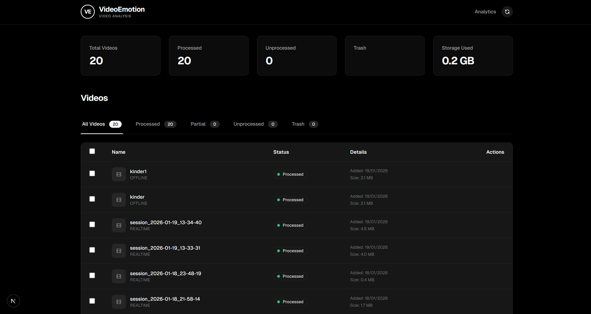
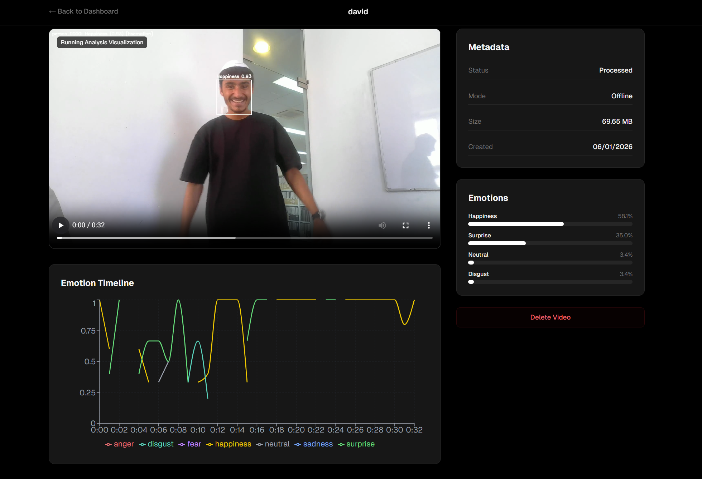
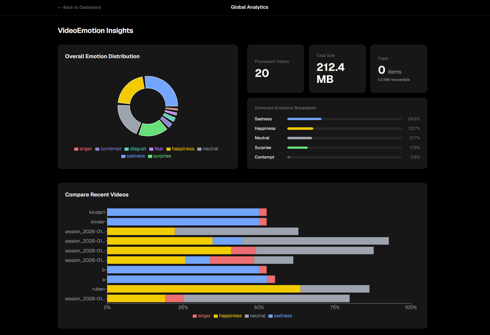
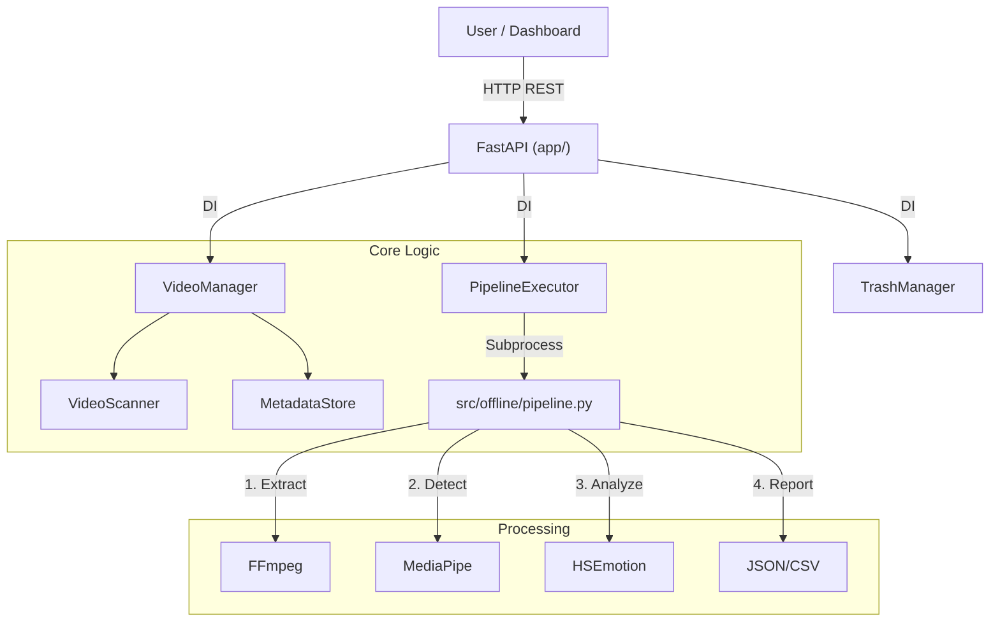
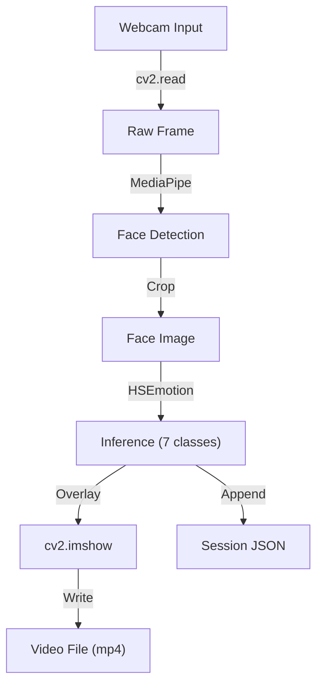

# Technical Report: VideoEmotion System

**Date:** January 19, 2026
**Project:** VideoEmotion - Advanced Emotion Analysis System
**Context:** University Final Project

---

## 1. Introduction

### Project Name
**VideoEmotion**

### Team Members
* BENSIMON RUBEN 
* SARFATI ETHAN 


### Context and Motivation
Understanding human emotional responses is critical across various fields, from market research (ad testing) to psychological studies and user experience (UX) evaluation. Traditional methods often rely on subjective self-reporting or manual annotation, which are time-consuming and prone to bias. **VideoEmotion** was developed to bridge this gap by providing an automated, scalable solution for detecting and classifying human emotions in video content using state-of-the-art Computer Vision (CV) and Machine Learning (ML) techniques.

### Problem Statement
Researchers and developers lack a unified, easy-to-use platform that handles the entire pipeline of video emotion analysis—from raw footage to actionable insights—while supporting both batch processing of archival files and real-time monitoring.

### Project Objectives
*   **Automation**: Fully automate the pipeline of face detection, emotion classification, and data aggregation.
*   **Flexibility**: Support both offline (batch) and real-time (webcam) analysis modes.
*   **Usability**: Provide a modern, user-friendly dashboard for non-technical users to manage videos and view results.
*   **Robustness**: Architect a system that is modular, testable, and capable of handling errors gracefully.

### Target Users
*   **Researchers**: For behavioral studies and data collection.
*   **Developers**: As a rigorous backend for building emotion-aware applications.
*   **System Administrators**: Managing video datasets and processing pipelines.

---

## 2. Project Overview

### High-Level Description
VideoEmotion is a client-server application comprising a high-performance **FastAPI** backend and a **Next.js** frontend dashboard. It utilizes a modular pipeline approach where heavy computational tasks (computer vision inference) are decoupled from the API layer to ensure responsiveness.

### Main Features
1.  **Offline Analysis Pipeline**:
    *   **Frame Extraction**: Intelligent logic to extract frames at configurable FPS.
    *   **Face Detection**: Uses **MediaPipe** to locate faces with high precision.
    *   **Emotion Classification**: Leverages **HSEmotion** (state-of-the-art CNNs) to classify 7+ emotions (Anger, Contempt, Disgust, Fear, Happiness, Sadness, Surprise).
    *   **Reporting**: Generates JSON and CSV summaries of emotional trends over time.
    *   **Visualization**: Renders annotated videos with bounding boxes and emotion labels.

2.  **Real-Time Analysis**:
    *   Provides a low-latency loop for capturing live webcam feeds, analyzing frames on the fly, and recording session data.

3.  **Video Management & Trash System**:
    *   Robust inventory management with a "Trash" mechanism (soft delete, restore, permanent delete) to prevent accidental data loss.
    
    ```python
    # src/core/trash_manager.py
    def move_to_trash(self, video_meta: VideoMetadata) -> TrashMetadata:
        """Atomic move operation: Metadata + Files"""
        timestamp = int(datetime.now().timestamp())
        trash_id = f"{video_meta.id}_{timestamp}"
        
        # 1. Create isolated trash directory
        trash_dir = self.trash_root / "offline" / trash_id
        
        # 2. Move files safely
        try:
             # Moves all related files (video, frames, reports)
            self._move_files(video_meta.file_paths, trash_dir)
        except Exception as e:
            # 3. Rollback on failure to prevent data corruption
            self._rollback_move(...)
            raise e
            
        return TrashMetadata(...)
    ```

### Expected Value
The system democratizes access to advanced emotion AI, allowing users to obtain granular emotional data without needing deep expertise in computer vision pipelines.

### User Interface
The application features a modern, responsive dashboard designed for ease of use.

**Dashboard - Video Inventory**

The main view provides a quick overview of all processed videos, their status, and storage usage.



**Video Analysis Details**

Detailed insights including per-frame emotion detection, timeline graphs, and confidence scores.



**General Analytics**

This dashboard provides a **global overview of emotion analysis results across all processed videos**.  



---

## 3. Project Architecture

The **VideoEmotion** system is built upon **Clean Architecture** principles, prioritizing the separation of concerns to ensure long-term maintainability, testability, and scalability.

### Architectural Strategy
The codebase is strictly divided into three distinct layers, each with specific responsibilities:
1.  **API Layer (`app/`)**: Handles external communication (HTTP requests), input validation, and response formatting. It is agnostic of the underlying emotion analysis logic.
2.  **Core Business Logic (`src/core/`)**: Contains the domain rules (e.g., `VideoManager`, `TrashManager`). It orchestrates operations but delegates heavy processing to specialized workers.
3.  **Processing / Worker Layer (`src/offline/`, `src/realtime/`)**: Consists of isolated scripts responsible for computationally expensive tasks like computer vision inference and video rendering.

### System Diagram
The following diagram illustrates the data flow and dependency graph, highlighting how the API relies on abstractions rather than concrete implementations of the heavy processing logic:



### Realtime System Diagram
The realtime loop operates on a frame-by-frame basis with low latency requirements.



### Layer Responsibilities
*   **API Layer**: Utilizes **Pydantic** models to rigorously validate all incoming data. It defines the "contract" between the frontend and the backend. Routers are kept thin, delegating logic immediately to injected services.
*   **Service Layer**: Represents the application's nervous system. It manages state (e.g., tracking video status), handles file system transactions (safe deletes), and orchestrates the execution of background jobs.
*   **Worker Layer**: Designed for **fault isolation**. By running heavy analysis scripts as separate subprocesses, we ensure that a segmentation fault in a C++ library (like OpenCV) or an Out-Of-Memory error in TensorFlow does not crash the main API server.

---

## 4. Folder Structure

The project's directory structure reflects its modular architectural design, separating the web server context from the core vision logic.

```text
VideoEmotion/
├── app/                  # FastAPI Application
│   ├── routers/          # Modular API Endpoints (videos, trash, pipeline...)
│   ├── config.py         # Configuration Loader (Env + YAML)
│   ├── dependencies.py   # Dependency Injection Setup
│   ├── main.py           # Application Entry Point
│   └── schemas/          # Pydantic Data Models
├── src/                  # Core Logic & Workers
│   ├── core/             # Business Logic (VideoManager, Models...)
│   ├── offline/          # Offline Pipeline Scripts
│   ├── realtime/         # Realtime Analysis Scripts
│   └── utils/            # Shared Utilities
├── data/                 # Input Data (Videos, Frames, etc.)
├── output/               # Generated Results (Reports, JSONs)
├── tests/                # Automated Test Suite
├── config.yaml           # Project Configuration
├── .env                  # Server Environment Variables (Secrets)
└── requirements.txt      # Python Dependencies
```

### Structure Analysis
*   **`app/` vs `src/`**: We consciously separated the web framework (`app/`) from the domain logic (`src/`). This prevents the business rules from becoming tightly coupled to FastAPI, theoretically allowing the same core logic to be used in a CLI tool or a different web framework.
*   **Modularity**: Top-level folders like `offline` and `realtime` clearly delineate the two primary modes of operation, making it easy for developers to locate relevant code.
*   **Scalability**: The `data/` and `output/` directories are designed to be mounted as external volumes in a containerized environment, ensuring data persistence independent of the application code.

---

## 5. Methodology and Design Decisions

### Architectural Approach: Layered Service Architecture
We adopted a clean, layered architecture to ensure separation of concerns.
*   **Justification**: This prevents the "God Object" anti-pattern where a single script handles API requests, database logic, and image processing. It simplifies testing and refactoring.

### Design Principles
*   **Dependency Injection (DI)**: Used extensively in the backend (`app/dependencies.py`). Services like `VideoManager` and `MetadataStore` are injected into routers, allowing them to be swapped or mocked easily during optimization or testing.

    ```python
    # app/dependencies.py
    @lru_cache()
    def get_video_manager() -> VideoManager:
        # Manual Dependency Injection of collaborators
        return VideoManager(
            # Settings and paths are injected here, keeping VideoManager clean
            project_root=settings.server.PROJECT_ROOT,
            scanner=VideoScanner(...),
            store=MetadataStore(...),
            stats_calculator=StatsCalculator(),
        )
    ```
*   **Single Responsibility Principle (SRP)**: Each class has a distinct role. For example, `TrashManager` handles file operations, while `EmotionResultsCleaner` handles the domain-specific logic of cleaning analysis results.
*   **Anti-Corruption Layer**: The `PipelineExecutor` isolates the core API from the unstable or resource-heavy external analysis scripts by running them as subprocesses. This ensures that a crash in the analysis pipeline does not bring down the web server.

### Defensive AI Design: Emotion Model Fallback
To enhance system reliability, we implemented a **Fallback Strategy** for emotion classification within the **Internal Offline Pipeline**.
*   **Scope**: Currently implemented for offline video processing processes only.
*   **Primary Model**: **HSEmotion** is used by default due to its speed and high accuracy on standard datasets.
*   **Secondary Model (Fallback)**: **DeepFace** (utilizing robust pre-trained backends) is available as a fallback.
*   **Justification**: This design ensures that if the primary model's confidence score drops below a critical threshold or if it fails to initialize in certain environments, the system can gracefully degrade to a secondary, robust model rather than failing completely. This improves overall system robustness versus raw accuracy.

    ```python
    # src/status/analyze_emotion.py
    def decide_final(hse_emotion, hse_conf, df_emotion, df_conf):
        """Determine final emotion based on confidence thresholds and fallback logic"""
        # Primary Model (HSEmotion)
        if hse_emotion and hse_conf >= HSEMOTION_CONFIDENCE_THRESHOLD:
            return hse_emotion, hse_conf, "hsemotion"
    
        # Fallback Model (DeepFace)
        if df_emotion and df_conf >= DEEPFACE_CONFIDENCE_THRESHOLD:
            return df_emotion, df_conf, "deepface"
            
        # If both are low confidence, mark as uncertain
        return None, 0.0, "uncertain"
    ```

### Constraints & Assumptions
*   **Platform**: The system assumes a Windows environment for file path handling (though `pathlib` is used to maximize cross-platform compatibility).
*   **Hardware**: Real-time analysis assumes the presence of a webcam and sufficient CPU/GPU power for inference.

---

## 6. System Architecture

The system follows a typical client-server model extended with background worker processes.

### Component Description
1.  **Frontend (Next.js)**: A React-based Single Page Application (SPA). It polls the API for status updates (e.g., pipeline progress) and renders visualizations.
2.  **API Gateway (FastAPI)**: Handles HTTP requests, validation (Pydantic), and routing. It allows for asynchronous request handling.
3.  **Core Logic (Service Layer)**:
    *   `VideoManager`: Facade for all video metadata operations.
    *   `TrashManager`: Handles safe deletion and restoration protocols.
    *   `PipelineExecutor`: Manages the lifecycle of background analysis jobs.
8.  **Processing Layer (Workers)**:
    *   Standalone Python scripts (`src/offline/pipeline.py`) that load heavy ML models. Running in separate processes avoids Python's Global Interpreter Lock (GIL) contention with the generic API.
    
    ```python
    # src/core/pipeline_executor.py
    def execute_job(self, job_id: str):
        # ...
        # Launch offline pipeline as independent subprocess
        process = subprocess.Popen(
            cmd,
            stdout=subprocess.PIPE, # Capture stdout for logging
            text=True,
            bufsize=1, # Line-buffered for realtime updates
        )
        
        # Stream logs without blocking the main thread
        for line in process.stdout:
            self.parser.parse_line(line) # Parse [1/5] progress
        # ...
    ```

    *   **Fallback Mechanism**: The worker implements logic to switch between `HSEmotion` and `DeepFace` based on runtime availability or confidence scores.

### Data Flow
1.  **Upload**: User uploads video -> API saves to disk -> `VideoManager` registers metadata -> Status: `UNPROCESSED`.
2.  **Processing**: User triggers analysis -> `PipelineExecutor` spawns subprocess -> Script logs progress (`[1/5] Extract...`) -> Executor parses logs -> Frontend updates progress bar.

    ```python
    # src/core/pipeline_parser.py
    class PipelineLogParser:
        def __init__(self):
            # Regex to reliably capture [Step/Total] pattern
            self._progress_pattern = re.compile(r"\[(\d+)/5\]")
    
        def parse_line(self, line: str) -> Optional[Tuple[int, str, float]]:
            match = self._progress_pattern.search(line)
            if match:
                # Returns standardized step index, name, and percentage
                step_idx = int(match.group(1))
                return step_idx, STEP_INFO[step_idx] # e.g. (1, "extract_frames", 20.0)
            return None
    ```

3.  **Visualization**: Processing Complete -> Results saved as JSON -> `VideoManager` aggregates stats -> Frontend fetches aggregated data for charts.

---

## 7. Technologies and Tools

*   **Languages**:
    *   **Python 3.10+**: Core backend and ML logic.
    *   **TypeScript/JavaScript**: Frontend logic.
*   **Frameworks & Libraries**:
    *   **Backend**: FastAPI, Uvicorn, Pydantic.
    *   **Frontend**: Next.js, React, Tailwind CSS.
    *   **Computer Vision**: OpenCV (`cv2`), MediaPipe (`mediapipe`), HSEmotion (`hsemotion`).
*   **Development Tools**:
    *   **Version Control**: Git & GitHub.
    *   **Testing**: Pytest.
    *   **Linting/Formatting**: Ruff (Python).
    *   **Virtual Environments**: `venv`.

---

## 8. Use of AI Tools

The development of VideoEmotion was significantly accelerated and refined through the use of an **AI Agent/Assistant**.

### Tool: Google DeepMind Agent (Antigravity/Gemini)
*   **Description**: An advanced large language model capable of "agentic" workflow—planning, writing code, executing terminal commands, and auditing files autonomously.
*   **Purpose**: Used for architectural auditing, complex refactoring, frontend component generation, and rigorous bug fixing.

### Concrete Examples of Usage
1.  **Codebase Auditing**:
    *   *Usage*: The AI was tasked to "Audit the codebase for SOLID principle violations."
    *   *Outcome*: It identified that `TrashManager` was violating the Single Responsibility Principle by handling both file I/O and domain-specific JSON cleanup.
    *   *Action*: The AI proposed and implemented the extraction of `EmotionResultsCleaner` logic into a separate class.
2.  **Refactoring**:
    *   *Usage*: "Refactor the pipeline logging to be robust."
    *   *Outcome*: The AI replaced brittle string matching (`if "Extract" in line`) with a dedicated `PipelineLogParser` class and standardized log constants, eliminating progress bar bugs.
3.  **Frontend Generation**:
    *   *Usage*: The AI generated the `ActivePipelineJobs.tsx` React component, handling the polling logic and UI rendering for real-time progress updates.

### Manual vs. AI-Assisted Implementation
*   **Manual**: Initial project setup, core idea conception, selection of ML models (HSEmotion), and defining the business requirements.
*   **AI-Assisted**: Boilerplate generation (FastAPI routers), architectural Refactoring, writing unit tests, and implementing complex UI state management logic.

### Advantages & Limitations
*   **Advantages**: Drastically reduced development time for standard patterns (CRUD); provided senior-level architectural advice (SOLID audit); automated tedious refactoring tasks.
*   **Limitations**: Occasionally struggled with large file contexts or specific existing file paths (needing "view_file" tools). Required human oversight to ensure business logic aligned with specific user requirements (e.g., removing specific UI text).

---

## 9. Development Process

### Phases
1.  **Requirement Analysis**: Defining Offline vs. Realtime needs.
2.  **Prototyping**: Building the `pipeline.py` script to verify ML model performance.
3.  **Backend Implementation**: Wrapping the script with FastAPI and creating `VideoManager`.
4.  **Frontend Implementation**: Building the Next.js dashboard.
5.  **Refactoring (Current Phase)**: Using AI to audit architecture, fix technical debt, and ensure modularity (`TrashManager` refactor).

### Challenges & Solutions
*   **Challenge**: The frontend progress bar was "jumping" backwards because the backend parsed ambiguous log lines.
*   **Solution**: Implemented a strict, monotonic progress update logic in `PipelineExecutor` and `PipelineLogParser`.
*   **Challenge**: `TrashManager` became bloatware, handling too many tasks.
*   **Solution**: Refactored logic into `EmotionResultsCleaner` to decouple concerns.

### Custom Model Training Attempt and Lessons Learned
Prior to adopting the current pretrained architectures, the team attempted to train a custom emotion recognition model from scratch using TensorFlow/Keras on **Google Colab**.

*   **Approach**: We curated a custom dataset combining FER-2013 with additional web-scraped face images, utilizing Colab's T4 GPUs for training acceleration.
*   **Outcome**: Despite testing various dataset sizes (from 5k to 30k images) and architectures (ResNet50, MobileNetV2), the custom models consistently:
    *   Showed poor generalization on real-world webcam footage.
    *   Suffered from significant overfitting, memorizing training noise rather than learning robust features.
    *   Underperformed significantly compared to off-the-shelf pretrained models like HSEmotion.
*   **Decision**: We decided to **abandon training from scratch** in favor of **fine-tuning** and using robust pretrained models.
*   **Justification**:
    *   **Data Availability**: High-quality, balanced emotion datasets are difficult to curate manually.
    *   **Cost-Performance**: Training from scratch yields diminishing returns compared to leveraging models trained on millions of images (Transfer Learning).
    *   **Engineering Pragmatism**: Using proven models allows the team to focus on system architecture and user experience rather than reinventing the wheel of feature extraction.

---

## 10. Testing and Evaluation

### Testing Strategy
*   **Unit Testing**: Covered core logic managers (`TrashManager`, `VideoManager`) to ensure file operations behave as expected.
*   **Integration Testing**: Verified API endpoints using FastAPI's `TestClient` to ensure routers correctly communicate with services.
*   **Manual System Testing**: End-to-end verification via the Dashboard (upload -> process -> verify results -> delete -> restore).

### Results
*   **Accuracy**: The HSEmotion model provides robust classification for standard expressions.
*   **Performance**: The offline pipeline processes a 1-minute video in approximately 20-40 seconds (depending on hardware), offering a viable speed for batch processing.

---

## 11. Limitations

1.  **Platform Dependency**: The current implementation strongly favors Windows file paths (`\` separators in some legacy logic), though efforts were made to use `pathlib` for portability.
2.  **Hardware Requirements**: Real-time analysis performance degrades significantly on machines without a dedicated GPU.
3.  **Browser Compatibility**: The generated `.mp4` visualizations must be encoded in H.264 for browser playback; the raw OpenCV output is often incompatible with modern browsers without conversion (handled by the pipeline).
4.  **Real-Time Maturity**: The Real-Time Analysis module was introduced in a later phase of development and currently lacks feature parity with the Offline pipeline (e.g., no fallback mechanism or detailed reporting execution).

---

## 12. Conclusion and Future Work

### Summary
VideoEmotion successfully delivers a modular, verifiable, and user-friendly system for video emotion analysis. By leveraging a clean architecture and creating a separation between the heavy lifting (ML scripts) and the API, the system is stable and scalable.

### Lessons Learned
*   **Architecture Matters**: Starting with a clean separation of services saved hours of debugging later.
*   **AI as a Partner**: Using an AI agent for code auditing acts like a "Peer Review," catching architectural flaws that might be missed during rapid development.

### Future Work
*   **Real-Time Enhancements**:
    *   **Fallback Mechanism**: Port the HSEmotion/DeepFace fallback logic to the realtime loop.
    *   **Smoothing**: Implement temporal smoothing (e.g., exponential moving average) to stabilize live emotion predictions and reduce jitter.
    *   **Targeted Analysis**: Enable "Picture-in-Picture" or overlay analysis, allowing the system to run on a specific screen region while the user interacts with other content (e.g., product testing).
    *   **Audio Analysis (Multimodal)**:
        *   **Offline Integration**: Implement a parallel pipeline stage to extract audio tracks using FFmpeg. Use advanced speech emotion recognition (SER) models (e.g., Wav2Vec2 or Whisper-based sentiment analysis) to analyze tonal and textual cues. These audio insights will be "late-fused" with visual emotion data to resolve ambiguities (e.g., distinguishing "Happy" from "Nervous Laughter").
        *   **Realtime Implementation**: Introduce a threaded audio capture module (using PyAudio) to run asynchronously alongside the video loop. Implementing a sliding window buffer will allow for continuous audio emotion classification, which can then be synchronized with the visual frame timestamp for a holistic live analysis.
*   **Dockerization**: Encapsulate the environment for easier deployment.
*   **Cloud Integration**: Allow storage of videos on S3/Azure Blob Storage.
*   **User Authentication**: Secure the admin dashboard for multi-user environments.

---

## 13. References

1.  **FastAPI Documentation**: https://fastapi.tiangolo.com/
2.  **MediaPipe Solutions**: https://developers.google.com/mediapipe
3.  **HSEmotion Library**: https://github.com/HSE-asavchenko/HSEmotion
4.  **Next.js Documentation**: https://nextjs.org/docs
5.  **Clean Architecture Principles (Robert C. Martin)**


---  


© 2026 VideoEmotion — Tous droits réservés